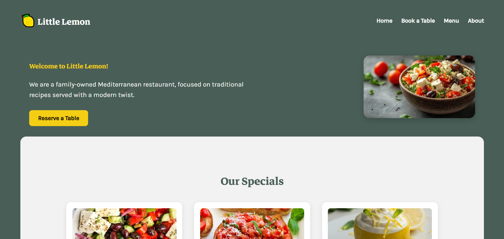

# Little Lemon Restaurant

This is the final capstone project for the **Meta Frontend Developer Professional Certificate** on Coursera.

## Overview

Little Lemon is a fictional Mediterranean restaurant. This website was built to demonstrate the skills learned throughout the certificate including:

- Semantic, accessible HTML
- Responsive CSS styling
- React components and hooks
- Form handling and validation
- React Router navigation
- UI enhancements (animations, layout, feedback)

## Features

- Fully responsive homepage, menu, booking, and about pages
- Table reservation form with confirmation and booking summary
- Styled using modern CSS practices
- React Router for multi-page navigation
- Confetti animation on successful booking 🎉

## Tech Stack

- React
- React Router
- CSS Modules
- JavaScript (ES6+)

## Screenshot



---

## Setup & Run Locally

```bash
git clone https://github.com/shina-wq/little-lemon-website.git
cd little-lemon-website
npm install
npm start
```
